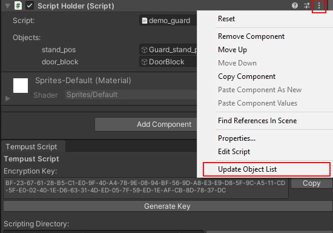

# The ScriptHolder Component
To attach a Tempust Script script to a Unity game object, use the ScriptHolder component. The game object will automatically run the "init" region on Start() and keep track of flags from the GameStateManager.

## Executing the Script
ScriptHolder contains a single public method: bool Execute(GameObject player = null) method. The player argument is added to the TSScript's list of objects under "plr", then the script is executed. If the user calls Execute() while the script is already running, it will return false.

## Update Object List
The menu for the ScriptHolder component includes an option labeled "Update Object List". Clicking this creates a list of all objects defined in the script, allowing game objects to be assigned to each through the inspector.

## The InteractScript Component
This component implements the OnInteract() method from TSInteractable. When a player interacts with it, it runs the script in the attached ScriptHolder class.

A similar component could be created to run when a player enters a trigger or to use an existing interaction system.